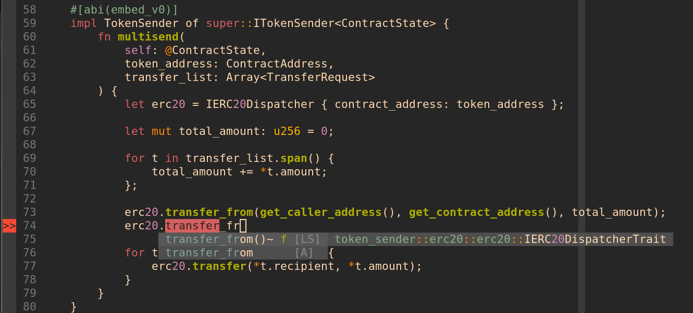

# Config Cairo 1.0 in vim

Currently added:

- Syntax highlight
- Auto-format
- Language-server

## Synatx highlight

Copy the file `cairo.vim` to `.vim/synatx/`

Add the following lines to `.vimrc`

```
" some cairo config
au BufReadPost *.cairo set filetype=cairo
au Filetype cairo set syntax=cairo
```

## Auto format

Build cairo1 locally. https://github.com/starkware-libs/cairo

Got the the dir and run `cargo build --release`

Add the following to `.vimrc`

```
" cairo 1.0
:autocmd BufWritePost *.cairo silent ! /path/to/cairo/target/release/cairo-format %
```

## Language server

You need to have [coc.nvim](https://github.com/neoclide/coc.nvim) installed

Install latest `Scarb`, perferably with [asdf](https://docs.swmansion.com/scarb/download.html#install-via-asdf)

```
asdf install scarb latest
```

After building as described above, add this to your `coc-settings.json`

```
  "languageserver": {
    "cairo": {
      "command": "/home/<USER>/.asdf/shims/scarb",
      "args": ["cairo-language-server"],
      "filetypes": ["cairo"]
    }
  },
```


